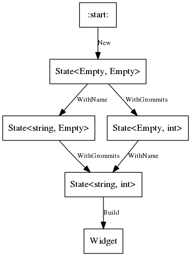

C# Smart Builder
================

This is a scheme for making a Builder-pattern approach that can check many properties of its supplied parameters at compile-time, using a combination of C#'s generic-type and extension-method machinery.
This saves unnecessary runtime checks and allows IDEs to give dynamic feedback on which parameter methods are applicable while writing the builder invocation.
Usages of the builder type are exactly the same as with a traditional builder, using `WithFoo()` methods to supply parameters, followed by a single `Build()` invocation to complete.

The only downside is that the specification of the builder type is a bit more verbose than usual (partly because C# can't infer some of the type parameter usages, hopefully some of this will improve over time).
This means that the smart builder approach is best suited for builders which are defined once and used many times.

This approach is also well-suited for builder types where it's observed that programmers keep accidentally specifying parameter combinations wrongly (forgetting mandatory parameters, specifying both of a mutually-exclusive pair, etc).  A smart builder will catch such problems at compile-time.

Of course at compile-time it cannot catch problems with the _values_ supplied to the parameters, only the combination of types.

Empty type
----------

We'll need this for later.  It's a type with exactly one possible value, namely `new Empty()`/`default(Empty)`.  We'll use this to fill in the "unset" type parameters in our `State` type.

```csharp
public struct Empty {
}
```

Example 1: One mandatory parameter
----------------------------------

A simple case first, to demonstrate the overall approach.

```csharp
public static class WidgetBuilder {
	public static State<Empty> New() {
		return new State<Empty>(new Empty());
	}

	public static State<string> WithName(this State<Empty> state, string name) {
		return new State<string>(name);
	}

	public static Widget Build(this State<string> state) {
		return new Widget(state.Name);
	}

	public struct State<TName> {
		public TName Name { get; }

		public State(TName name) {
			Name = name;
		}
    }
}
```

Here's a state machine diagram showing the various transitions.


Sadly C# won't infer the type parameters for those constructor calls, otherwise our life would be much easier.
What we could do is introduce a helper function, since regular functions _do_ benefit from type parameter inference:

```csharp
private static State<T> Create<T>(T arg1) {
	return new State<T>(arg1);
}
```

Another point of interest is to note that `State` is just a simple immutable product type, so we could replace it with just a `Tuple` instance if we don't mind having ugly property names like `.Item1`, `.Item2`, etc.  When C# 7 lands with its improved tuple syntax and named tuple fields, it will be a clear winner and we won't need this `State` type at all.


Example 2: Two mandatory parameters
-----------------------------------

Because we don't require `WithName()` and `WithGrommits()` to be called in any particular order, we use an arbitrary type parameter in both methods to fill the type of the other field.  For instance, in `WithGrommits()`, the type parameter `T` could be either `Empty` or `string`.

```csharp
public static class WidgetBuilder {
	public static State<Empty, Empty> New() {
		return new State<Empty, Empty>(new Empty(), new Empty());
	}

	public static State<string, T> WithName<T>(this State<Empty, T> state, string name) {
		return new State<string, T>(name, state.NumGrommits);
	}

	public static State<T, int> WithGrommits<T>(this State<T, Empty> state, int num_grommits) {
		return new State<T, int>(state.Name, num_grommits);
	}

	public static Widget Build(this State<string, int> state) {
		var grommits = Enumerable.Range(0, state.NumGrommits).Select(i => new Grommit()).ToList();
		return new Widget(state.Name, grommits);
	}

	public struct State<TName, TNumGrommits> {
		public TName Name { get; }
		public TNumGrommits NumGrommits { get; }

		public State(TName name, TNumGrommits num_grommits) {
			Name = name;
			NumGrommits = num_grommits;
		}
    }
}
```

Here's the corresponding state machine.



You can see here that each parameter method provided two transitions in the state machine thanks to the type parameter.  If we generalise the above to _n_ parameter methods, each method would provide _2<sup>n</sup>_ transitions.

If you trace the graph, you can see that every path from `:start:` to `Widget` traverses exactly one `WithName()` edge and exactly one `WithGrommits()` edge.  This ensures the properties we wanted, i.e. that both parameters are mandatory and must not be specified multiple times.


Example 3: Adding a conditionally-available parameter
-----------------------------------------------------

Suppose we want callers to state what kind of grommit their widget must use.  Let's add a `WithGrommitSpecies()` parameter method, and set up our smart builder so that the method is only available once `WithGrommits()` has been specified.  All parameters are still mandatory at this point.

```csharp
public static class WidgetBuilder {
	public static State<Empty, Empty, Empty> New() {
		return new State<Empty, Empty, Empty>(new Empty(), new Empty(), new Empty());
	}

	public static State<string, T2, T3> WithName<T2, T3>(this State<Empty, T2, T3> state, string name) {
		return new State<string, T2, T3>(name, state.NumGrommits, state.GrommitSpecies);
	}

	public static State<T1, int, Empty> WithGrommits<T1>(this State<T1, Empty, Empty> state, int num_grommits) {
		return new State<T1, int, Empty>(state.Name, num_grommits, state.GrommitSpecies);
	}

	public static State<T1, int, GrommitSpecies> WithGrommitSpecies<T1>(this State<T1, int, Empty> state, GrommitSpecies grommit_species) {
		return new State<T1, int, GrommitSpecies>(state.Name, state.NumGrommits, grommit_species);
	}

	public static Widget Build(this State<string, int, GrommitSpecies> state) {
		var grommits = Enumerable.Range(0, state.NumGrommits).Select(i => new Grommit(state.GrommitSpecies)).ToList();
		return new Widget(state.Name, grommits);
	}

	public struct State<TName, TNumGrommits, TGrommitSpecies> {
		public TName Name { get; }
		public TNumGrommits NumGrommits { get; }
		public TGrommitSpecies GrommitSpecies { get; }

		public State(TName name, TNumGrommits num_grommits, TGrommitSpecies grommit_species) {
			Name = name;
			NumGrommits = num_grommits;
			GrommitSpecies = grommit_species;
		}
    }
}
```

Here's the corresponding state machine.


Although the graph is a bit more complicated, you can see that every path from `:start:` to `Widget` still passes through an edge for each parameter exactly once.

Example 4: Making a parameter optional
--------------------------------------

Suppose we'd like to fill in a default of zero for `NumGrommits` if it's not specified.  Their species doesn't really matter in this case, so the client code won't need to specify `GrommitSpecies` either.
We can accomplish this by just taking our builder from Example 3 and adding a new `Build()` overload:

```csharp
	public static Widget Build(this State<string, Empty, Empty> state) {
		return new Widget(state.Name, new List<Grommit>());
	}
```

This corresponds to adding a single new edge to our state machine:


This new edge gives us a route through the graph which doesn't pass through any `WithGrommits()`/`WithGrommitSpecies()` edges, meaning they are optional in the builder.

This would probably be a good point to make `WithGrommits()` check that its argument is greater than zero, so that there's exactly one way to specify that the widget has no grommits.  Note that this is a _value_ restriction, so it will have to be a runtime check within `WithGrommits()` rather than part of our smart builder (which just checks types).

Example 5: Mutually-incompatible parameters
-------------------------------------------

Currently, if the widget is specified to have grommits, we have to specify a `GrommitSpecies` and all the grommits will be created with that species.  Suppose we want to also provide the possibility of passing a `StreamProducer<Grommit>` from which we simply take the next few grommits produced (with the producer deciding their species).

This means that, after users of our builder specify that they want the widget to be created `WithGrommits()`, they must specify exactly one of `WithGrommitSpecies()` or `WithGrommitProducer()`.  Specifying both should be forbidden.  Since they never show up at the same time, we can cut down on the number of type parameters in our solution by using a single slot called `GrommitCreation` to hold either the species or the producer (we could also have just created a new slot, but ain't nobody got time for that).

```csharp
public static class WidgetBuilder {
	public static State<Empty, Empty, Empty> New() {
		return new State<Empty, Empty, Empty>(new Empty(), new Empty(), new Empty());
	}

	public static State<string, T2, T3> WithName<T2, T3>(this State<Empty, T2, T3> state, string name) {
		return new State<string, T2, T3>(name, state.NumGrommits, state.GrommitCreation);
	}

	public static State<T1, int, Empty> WithGrommits<T1>(this State<T1, Empty, Empty> state, int num_grommits) {
		return new State<T1, int, Empty>(state.Name, num_grommits, state.GrommitCreation);
	}

	public static State<T1, int, GrommitSpecies> WithGrommitSpecies<T1>(this State<T1, int, Empty> state, GrommitSpecies grommit_species) {
		return new State<T1, int, GrommitSpecies>(state.Name, state.NumGrommits, grommit_species);
	}

	public static State<T1, int, StreamProducer<Grommit>> WithGrommitProducer<T1>(this State<T1, int, Empty> state, StreamProducer<Grommit> grommit_producer) {
		return new State<T1, int, StreamProducer<Grommit>>(state.Name, state.NumGrommits, grommit_producer);
	}

	public static Widget Build(this State<string, int, GrommitSpecies> state) {
		var grommits = Enumerable.Range(0, state.NumGrommits).Select(i => new Grommit(state.GrommitCreation)).ToList();
		return new Widget(state.Name, grommits);
	}

	public static Widget Build(this State<string, int, StreamProducer<Grommit>> state) {
		var grommits = state.GrommitCreation.Take(state.NumGrommits);
		return new Widget(state.Name, grommits);
	}

	public static Widget Build(this State<string, Empty, Empty> state) {
		return new Widget(state.Name, new List<Grommit>());
	}

	public struct State<TName, TNumGrommits, TGrommitCreation> {
		public TName Name { get; }
		public TNumGrommits NumGrommits { get; }
		public TGrommitCreation GrommitCreation { get; }

		public State(TName name, TNumGrommits num_grommits, TGrommitCreation grommit_creation) {
			Name = name;
			NumGrommits = num_grommits;
			GrommitCreation = grommit_creation;
		}
    }
}
```

The state machine is now getting a bit messy, reading the code is probably easier at this point.  You can see the combinatorics in action: we've only specified each parameter method once, and each of the `Build()` variants once, but the type generalisation gives us multiple routes through the graph.


Integrity Checking
------------------

For the above examples, we could check the graph by eye to make sure every path was valid, but for builders with larger numbers of parameter methods this will become unwieldy.
Luckily, there are some simple integrity checks we can carry out to make sure that the builder is valid.

For the above examples, we could check the graph by eye to make sure every path was valid, but for builders with larger numbers of parameter methods this will become unwieldy.
Luckily, there are some simple integrity checks we can carry out to make sure that the builder is valid.

1. The `New()` method should produce a state with all slots empty.  At least one parameter method should accept this type (possibly by specialising some of its type parameters to `Empty`).
2. Each parameter method should fill an empty slot (or modify an existing slot) based on its stated function.  Other slots should remain unchanged.  The language type-checking will help enforce this.
3. Each `Build()` method should accept a valid state based on its function.  The language type-checking will help here too, since a `Widget` constructor can't be called unless the `Build()` method has values of the right types available.
4. For each parameter method and each possible specialisation of its output type, there should be at least one parameter method or `Build()` variant which accepts that type.

Rule 4 is the main one that requires some manual verification.  Ideas on how to automate this are welcome!

